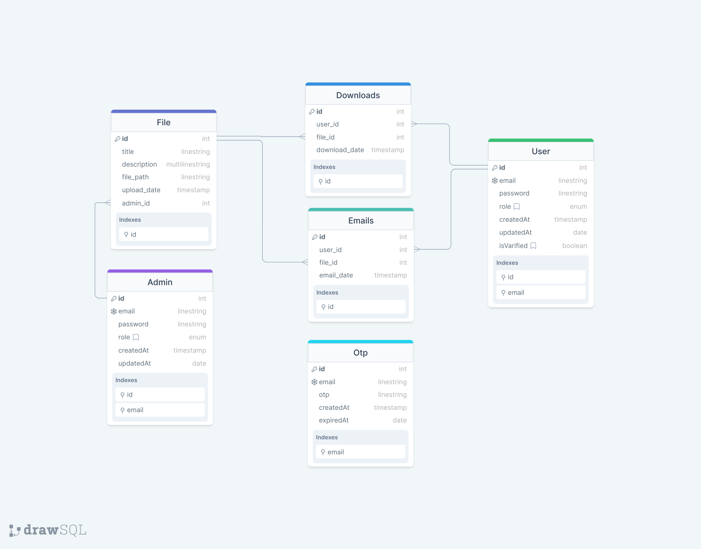

# File Server

## Introduction

File Server is a digital platform designed to distribute documents such as wedding cards, admission forms, etc. on behalf of various businesses to different users. The platform allows users to easily access and download files remotely, and it includes features for account management, file searching, and email integration.

## Prerequisites

- Node.js
- PostgreSQL
- TypeScript
- Express
- Prisma
- JWT
- Nodemailer
- Swagger
- Cors
- Bcrypt
- Dotenv
- Multer
- Jest
- Supertest


## Installation

To get a development environment running:

```bash
npm install
npm run build
npm start
```
##ENVIRONMENT VARIABLES
```bash
DATABASE_URL
PORT
JWT_EXPIRE
JWT_SECRET
AUTH_EMAIL
AUTH_PASSWORD 
```
## END POINTS
1. User
    - POST sign-up [endpoint](https://file-server-ndag.onrender.com/v1/api/users/sign-up)
        Allows users to sign up with an email and password.
    
    - POST verify [endpoint](https://file-server-ndag.onrender.com/v1/api/users/verify)
        Allows users to verify their email with a verification code.
    
    - POST request-otp [endpoint](https://file-server-ndag.onrender.com/v1/api/users/request-otp)
        Allows users to request an OTP to verify their email.
     
    - POST sign-in [endpoint](https://file-server-ndag.onrender.com/v1/api/users/sign-in)
        Allows users to log in with their email and password.

    - POST forgot password [endpoint](https://file-server-ndag.onrender.com/v1/api/users/forgot-password)
        Allows users to reset their password by sending a verification code to their email.

    - POST reset password [endpoint](https://file-server-ndag.onrender.com/v1/api/users/reset-password)
        Allows users to reset their password by providing a new password.

    - GET all Files [endpoint](https://file-server-ndag.onrender.com/v1/api/files/)
        Allows users to view all files.

    - GET a File [endpoint](https://file-server-ndag.onrender.com/v1/api/file/:id)
        Allows users to view a file.

    - GET download a file [endpoint](https://file-server-ndag.onrender.com/v1/api/files/download/:id)
        Allows users to download a file.

    - GET download a file via email [endpoint](https://file-server-ndag.onrender.com/v1/api/files/email:id)
        Allows users to download a file via email.

  
2. Admin
    - POST sign-in [endpoint](https://file-server-ndag.onrender.com/v1/api/admins/sign-in)
        Allows admins to log in with their email and password.

    - POST upload a file [endpoint](https://file-server-ndag.onrender.com/v1/api/files/upload)
        Allows admins to upload a file.

    - GET Stats a files [endpoint](https://file-server-ndag.onrender.com/v1/api/files/stats/)
        Allows admins to view all files stats.

    - GET Stats a file [endpoint](https://file-server-ndag.onrender.com/v1/api/files/stats/:id)
        Allows admins to view a file stats.


## ER Diagram
[Link Here](https://drawsql.app/teams/agbobli/diagrams/fileserverdb)



## OFFICIAL SWAGGER DOCUMENTATION HERE 
[Link Here](https://file-server-ndag.onrender.com/api/docs/#/)


    

